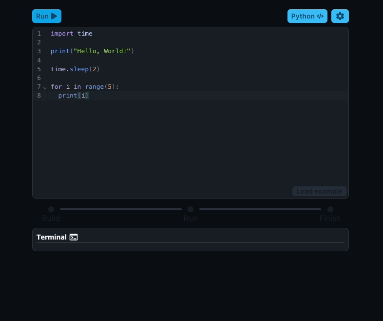
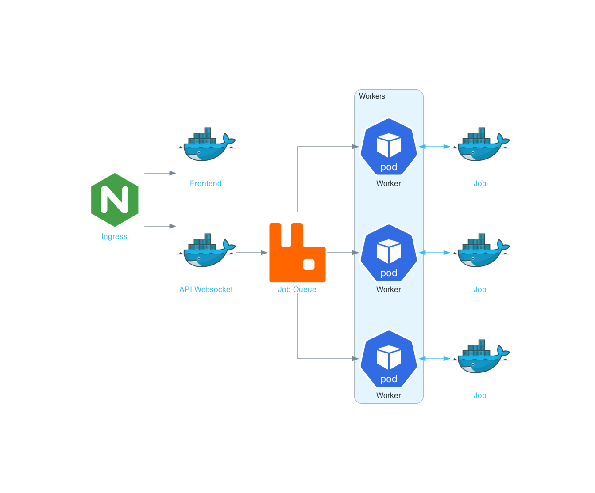

<a href="https://alexwith.com">
    

        
    

</a>

  <strong>Execute code quickly in the browser!</strong>

---

## The Project
Run is a simple app to execute small code snippets in the browser. Each execution starts it's own docker container
limited by memory, time, CPU and internet access. The docker container establishes a socket connection with your client
to get a real time console feed. The app can be found at [run.alexwith.com](https://run.alexwith.com/)

## Preview

## Architecture
Below is a rough sketch of Run's architecture

## License
Run is free and open source software. The software is released under the terms of the [GPL-3.0 license](https://github.com/alexwith/run/blob/main/LICENSE).